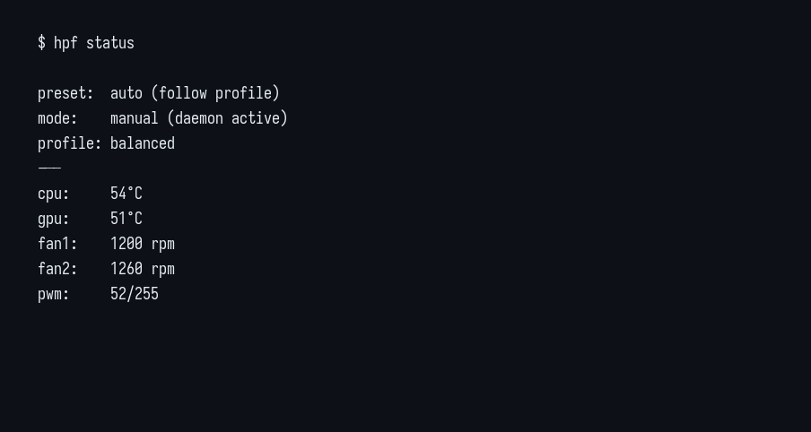
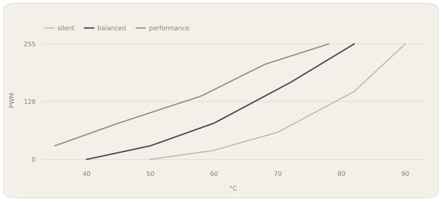

# HP Fan Control for Linux — hpfand

`hpfand` is a lightweight Linux fan-control daemon for supported HP Victus and
HP Omen laptops. It reads CPU and GPU temperatures from Linux `hwmon`, applies
a configurable fan curve, and writes the resulting PWM value through the
kernel's native `hp_wmi` interface.

Use it to control HP laptop fans on Linux with automatic CPU/GPU fan curves,
silent, balanced, and performance presets, live RPM monitoring, and a small
`hpf` command-line interface. It does not require a GUI or direct
embedded-controller access.

<table>
  <tr>
    <td width="50%"></td>
    <td width="50%"></td>
  </tr>
</table>

The daemon is a single Bash process managed and sandboxed by systemd.

## Why hpfand?

- **Install and forget.** The default fan curve automatically follows the
  system's `low-power`, `balanced`, and `performance` platform profiles.
- **Almost zero configuration.** Safe defaults work without a config file;
  presets and custom CPU/GPU curves remain available when wanted.
- **Native kernel interface.** It uses the upstream Linux `hp_wmi` hwmon
  interface, with no patched DKMS module or direct embedded-controller access.
- **Small and least-privileged.** The Bash daemon runs as a dedicated
  unprivileged user and only receives access to the required PWM attributes.
- **Thermal fail-safes.** Invalid sensors, emergency temperatures, fan stalls,
  failed writes, and stuck control loops all have explicit recovery paths.



## Check support

```sh
ls /sys/devices/platform/hp-wmi/hwmon/hwmon*/pwm1 >/dev/null 2>&1 \
  && echo supported || echo unavailable
```

If this prints `unavailable`, hpfand cannot control the machine. Do not install
it until the running kernel exposes the interface. See the
[hardware matrix](docs/hardware.md) for verified machines.

## Install

> [!WARNING]
> Fan control can cause overheating or thermal shutdowns. Confirm hardware
> support first, keep the firmware's thermal protections enabled, and test
> custom curves conservatively.

From source:

```sh
git clone https://github.com/emomaxd/hpfand.git
cd hpfand
sudo ./install.sh
```

The installer requires systemd and refuses to enable the service unless the
PWM interface is already present. It installs `hpfand` and `hpf` under
`/usr/local/bin` by default. `udev` and `flock` (from util-linux) are required.
The daemon runs as a dedicated unprivileged `hpfand` user; a narrowly scoped
udev rule grants that user access only to the HP PWM attributes.

No configuration is required after installation. When the kernel exposes a
platform profile, hpfand follows it automatically; otherwise it safely remains
on the balanced curve.

To let the current user toggle silent mode without root:

```sh
sudo usermod -aG hpfand "$USER"
```

Log out and back in after changing group membership.

## Commands

```text
hpf status              show temperatures, RPM, PWM and active profile
hpf status -w           refresh status every two seconds
hpf toggle              toggle silent mode
hpf presets             list built-in curves
hpf log 50              read daemon logs

sudo hpf set balanced   apply silent, balanced or performance
sudo hpf follow         follow the ACPI platform power profile
sudo hpf edit           edit /etc/hpfand.conf and restart the daemon
hpf check               validate /etc/hpfand.conf without changing fan state
sudo hpf pwm 120        stop the daemon and hold a fixed PWM value
```

`hpf pwm` disables the daemon's thermal response. Apply a preset to restore it.
The command verifies both sysfs writes and attempts to restore firmware control
if locking the requested PWM fails.

## Control loop

Each poll reads the CPU package temperature and, when active, the discrete GPU
temperature. The higher PWM request wins. Curve points are linearly
interpolated; increases happen immediately subject to `SLEW_UP`, while
decreases wait for the configured hysteresis and follow `SLEW_DOWN`.

The daemon only updates sysfs when the PWM changes. Failed writes are retried.
Three invalid CPU readings force PWM 255. On a clean shutdown, control returns
to firmware mode and the handoff is verified. A raw CPU or GPU reading at or
above `EMERGENCY_TEMP` bypasses smoothing, hysteresis, and slew limiting and
immediately requests PWM 255. If either fan reports a stall while PWM is high,
the daemon also requests PWM 255 and identifies the affected fan in the log.

On multi-GPU systems, every supported GPU hwmon temperature is considered and
the hottest valid reading drives the GPU curve.

Temperature increases use the hotter of the raw and smoothed readings, so EMA
filtering cannot delay a fan-speed increase. Smoothing still applies while
temperatures fall. Startup down-slew protection is time-based rather than tied
to the configured polling interval. Only one daemon instance may hold the PWM
controller lock. systemd also watches the control-loop heartbeat and restarts a
stuck daemon; polling intervals are therefore limited to 1–10 seconds.

`hpf follow` maps platform profiles as follows:

| platform profile | curve |
|---|---|
| `low-power` | silent |
| `balanced` | balanced |
| `performance` | performance |

## Configuration

`/etc/hpfand.conf` is a restricted numeric data file, not a shell script.

```sh
CT=(40 50 60 72 82)
CP=(0 30 80 170 255)

GPU_CT=(45 55 65 75 85)
GPU_CP=(0 40 100 180 255)

HYST=6
POLL_SEC=2
SLEW_UP=100
SLEW_DOWN=20
MIN_PWM=0

FOLLOW_PLATFORM_PROFILE=1
RPM_STALL_WARN=1
SILENT_OFF_BELOW=0
EMERGENCY_TEMP=95
```

`CT`/`GPU_CT` are degrees Celsius. `CP`/`GPU_CP` are PWM values from 0 to 255.
GPU arrays are optional and default to the CPU curve. `SILENT_OFF_BELOW=0`
uses the second curve point. `EMERGENCY_TEMP` accepts 70–100°C and is
independent of the configured curves. Invalid live reloads retain the last
known-good configuration instead of changing the active curve.

When platform-profile following is enabled, a custom GPU curve remains intact;
only the CPU curve follows the selected platform profile.

If `inotify-tools` is installed, atomic saves reload the file without a service
restart. Inspect curve output without touching PWM:

```sh
sudo hpfand --dry-run
```

## Troubleshooting

- `hp-wmi hwmon not found`: the running kernel does not expose the interface,
  or the board is not supported.
- Fan speed does not change: check `hpf status` and `hpf log 50`; mode must be
  `manual (daemon active)`.
- GPU temperature is absent: a discrete GPU in D3cold has no active hwmon
  sensor. It is detected when the GPU wakes.
- PWM disappeared after a kernel update: verify that the running kernel still
  exposes the `hp_wmi` PWM interface. hpfand does not install kernel drivers.

For new hardware, open a
[compatibility report](https://github.com/emomaxd/hpfand/issues/new?template=hardware.yml).

## Uninstall

```sh
sudo ./uninstall.sh
```

## Development

The regression suite runs the daemon against a simulated hwmon tree; it does
not write to the host's fan controls:

```sh
tests/test_hpfand.sh
```

Licensed under GPL-2.0-only.
